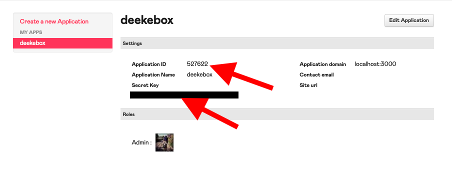

# deekebox
A tool to organize Deezer favourties into moods

## Getting started
### Required files
1. Copy .env.template to .env
1. Sent the values `APP_ID` and `APP_SECRET`
    1. 
1. Run the server to complete the handshake and follow the instructions
    1. `ruby deekebox.rb`

### Resources
1. [Deezer docs on the OAuth handshake](https://developers.deezer.com/api/oauth)
